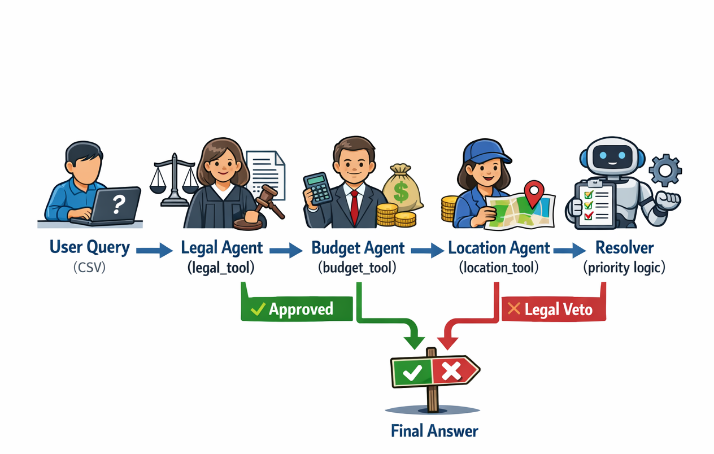

# LangGraph Multi‑Agent System

A production‑ready multi‑agent system built with **LangGraph**, **LangSmith**, and **Ollama**.  
Implements a **priority‑based** multi‑agent flow (Legal → Budget → Location → Resolver) with tool integration, real‑world data (CSV), and legal veto logic.  

Supports **both sequential and parallel execution** – users can choose at runtime via API.  
Exposed as a **FastAPI** service with CORS, ready to be called from any frontend or integrated into n8n workflows (WIP).

## Architecture



It visually maps the path from User Query through the agents (Legal, Budget, Location), into the Resolver, and finally down to the Final Answer with clear approval or veto outcomes.

- **ReAct reasoning** inside each specialist
- **Shared state** passed through LangGraph
- **Tool‑augmented** specialists using CSV data
- **Legal veto** overrides all other opinions
- **LangSmith tracing** for observability

## Features

- **Two execution modes** – sequential (linear chain) or parallel (concurrent specialists)
- **FastAPI wrapper** with CORS support for web demos
- **Performance comparison** – parallel mode reduces total time from sum to max
- **In‑memory SQLite** for efficient property search (threshold‑based)
- **Public demo** – exposed via ngrok (or localhost.run) with a simple HTML frontend
- **Ready for n8n** – simple HTTP POST endpoint

## Prerequisites
- Python 3.10+
- Ollama with `phi3:mini` (or `llama3.2:3b`)
- (Optional) LangSmith account for tracing
- (Optional) ngrok or localhost.run for public exposure

## Installation

```bash
git clone https://github.com/raj266/agentic-ai-portfolio.git
cd agentic-ai-portfolio
pip install -r requirements.txt
```
## Running the Agent
```bash
python run_agent.py
```

## Running the FastAPI Service
```bash
python fastapi_wrapper.py
```
The API will be available at http://localhost:8000.

## API Endpoints
- POST /agent – accepts JSON: {"query": "...", "mode": "sequential"|"parallel"}
Returns: {"final_answer": "...", "elapsed_time": 123.45, "mode_used": "parallel"}

- GET /health – health check

## Sample curl (Parallel and Sequential)

```
curl -X POST http://localhost:8000/agent \
  -H "Content-Type: application/json" \
  -d '{"query": "Find me a 3BHK in Whitefield under 5 Crore", "mode": "parallel"}'
```
```
curl -X POST http://localhost:8000/agent \
  -H "Content-Type: application/json" \
  -d '{"query": "Find me a 3BHK in Whitefield under 5 Crore", "mode": "sequential"}'
```

## Public Demo (ngrok)
1. Start FastAPI: python fastapi_wrapper.py
2. In another terminal: ngrok http 8000
3. Use the provided ngrok URL as your API endpoint.

## Performance Comparison

Parallel execution runs all three specialists concurrently, reducing wall‑clock time from the sum to the maximum of the three.

## File Structure

`run_agent.py` – Entry point

`fastapi_wrapper.py` – (Coming soon) API wrapper for n8n

`langgraph_agent.py` – Graph definition, nodes, edges

`tools.py` – CSV‑backed tools (search, legal, cost, connectivity)

`prompts.py` – Specialist prompts (legal, budget, location)

`call_ollama.py` – Ollama client

`properties.csv` – Example property data

`arch.png` – Architecture diagram

## License
MIT
